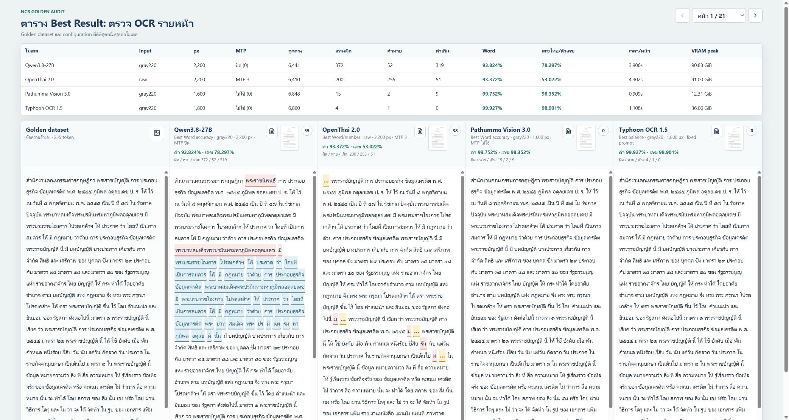

# Thai OCR Benchmark 2026

ผลทดสอบ OCR ภาษาไทยบนชุดกฎหมาย **พระราชบัญญัติการประกอบธุรกิจข้อมูลเครดิต**
21 หน้า โดยเทียบ OCR กับ Golden dataset ที่ตรวจจากภาพจริงทีละหน้า ไม่ใช้ PDF
text layer เป็นคำตอบอ้างอิง เพราะ text layer ของไฟล์ต้นฉบับมีความเสียหายอยู่แล้ว.
Repository นี้เผยแพร่เฉพาะรายละเอียดและหลักฐานของชุด NCB นี้เท่านั้น.

## Best Result ที่แนะนำ



| โมเดล | Input | px | MTP ที่ใช้ | ถูกตรง | แทนผิด | คำหาย | คำเกิน | Word accuracy | เลขไทย/ตัวเลข | เวลา/หน้า | VRAM peak |
|---|---|---:|---|---:|---:|---:|---:|---:|---:|---:|---:|
| Qwen3.8-27B | `gray220` | 2,200 | ปิด (0) | 6,441 | 372 | 52 | 319 | 93.824% | 78.297% | 3.906s | 90.88 GiB |
| OpenThai 2.0 | `raw` | 2,200 | MTP 3 | 6,410 | 200 | 255 | 51 | 93.372% | 53.022% | 4.302s | 91.00 GiB |
| Pathumma Vision 3.0 | `gray220` | 1,600 | ไม่ใช้ (0) | 6,848 | 15 | 2 | 9 | 99.752% | 98.352% | 0.909s | 12.31 GiB |
| Typhoon OCR 1.5 | `gray220` | 1,800 | ไม่ใช้ (0) | 6,860 | 4 | 1 | 0 | 99.927% | 98.901% | 1.108s | 36.06 GiB |

**ข้อแนะนำ:** Typhoon เป็นตัวเลือกหลักเมื่อความถูกต้องของข้อความและตัวเลขสำคัญที่สุด.
Pathumma เป็นทางเลือกที่ใกล้เคียงมากและใช้ VRAM ต่ำกว่า. Qwen และ OpenThai ใช้
VRAM ราว 91 GiB ในชุดทดสอบนี้ จึงควรรันเดี่ยวบนเครื่อง Blackwell.

`gray220` คือการแปลงภาพเป็น grayscale แล้วทำ pixel ที่มี luminance ตั้งแต่ 220
ให้เป็นสีขาว เพื่อลด watermark สีอ่อนเท่านั้น ไม่ใช่การ fine-tune หรือ parameter
ของโมเดล. ทุกโมเดลทดสอบ `raw` และ `gray220` ที่ด้านยาวสุด 1,024, 1,400,
1,600, 1,800, 2,000 และ 2,200 px รวม 48 run. เงื่อนไขร่วมคือหนึ่งภาพต่อ request,
`temperature=0`, client concurrency 7, vLLM `max-num-seqs=7`, `max_tokens=8192`
และไม่ใช้ PP-DocLayoutV3, crop หรือ rotate ในรอบนี้.

## เวอร์ชันไลบรารีที่ใช้รัน

บันทึกจาก venv ที่ใช้รันชุด NCB เมื่อ 29 สิงหาคม 2026 เพื่อให้ทำซ้ำผลได้.
Qwen, Pathumma และ Typhoon แยก process ของ vLLM แต่ใช้ runtime image ชุดเดียวกัน;
OpenThai ใช้ venv BF16 แยกต่างหาก. ทุกแถวด้านล่างเป็นเวอร์ชันที่ตรวจจาก
environment จริง ไม่ใช่เวอร์ชันที่คาดเดาจากเอกสารของโมเดล.

| โมเดล | Runtime | Python | vLLM | PyTorch | Transformers | FlashInfer | Tokenizers |
|---|---|---|---|---|---|---|---|
| Qwen3.8-27B | shared vLLM | 3.12.3 | 0.27.1 | 2.13.0+cu132 | 5.15.1 | 0.6.16.post3 | 0.22.2 |
| OpenThai 2.0 | isolated BF16 venv | 3.12.3 | 0.27.1 | 2.13.0+cu132 | 5.15.1 | 0.6.16.post3 | 0.22.2 |
| Pathumma Vision 3.0 | shared vLLM | 3.12.3 | 0.27.1 | 2.13.0+cu132 | 5.15.1 | 0.6.16.post3 | 0.22.2 |
| Typhoon OCR 1.5 | shared vLLM | 3.12.3 | 0.27.1 | 2.13.0+cu132 | 5.15.1 | 0.6.16.post3 | 0.22.2 |

`+cu132` หมายถึง PyTorch build สำหรับ CUDA 13.2. ดูขอบเขตการบันทึกและ
ไลบรารีประกอบได้ที่ [รายงานเวอร์ชัน runtime](results/NCB_RUNTIME_LIBRARY_VERSIONS_2026-08-29.md).

## ตรวจรายหน้า

[หน้า Best Result แบบ 5 คอลัมน์](dashboard/ncb_best_result_comparison.html) แสดง
Golden dataset, Qwen3.8-27B, OpenThai 2.0, Pathumma และ Typhoon เพียงชุดที่ชนะของ
แต่ละโมเดล. ทุกคอลัมน์มีภาพที่ส่งเข้า inference จริง, ข้อความ OCR, สี highlight
ของคำแทนผิด/คำหาย/คำเกิน และ modal สำหรับตรวจคู่เทียบ.

เปิดในเครื่อง:

```bash
python -m http.server 7012 --bind 0.0.0.0
```

จากนั้นเปิด `http://localhost:7012/dashboard/ncb_best_result_comparison.html?page=1`.

## Notebooks ที่มี Output การทดสอบ

Notebook แต่ละไฟล์เก็บ output ของการ run แยกทุกความละเอียดและ input `raw`/
`gray220` รวมถึงผล OCR รายหน้าและคะแนนที่นำมาสรุปในตารางข้างต้น.

| โมเดล | Notebook |
|---|---|
| Qwen3.8-27B | [qwen38_resolution_sweep_raw_gray220_20260829.ipynb](notebooks/qwen38_resolution_sweep_raw_gray220_20260829.ipynb) |
| OpenThai 2.0 | [openthai2_resolution_sweep_raw_gray220_20260829.ipynb](notebooks/openthai2_resolution_sweep_raw_gray220_20260829.ipynb) |
| Pathumma Vision 3.0 | [pathumma_resolution_sweep_raw_gray220_20260829.ipynb](notebooks/pathumma_resolution_sweep_raw_gray220_20260829.ipynb) |
| Typhoon OCR 1.5 | [typhoon_resolution_sweep_raw_gray220_20260829.ipynb](notebooks/typhoon_resolution_sweep_raw_gray220_20260829.ipynb) |

## รีวิวคำคลาดเคลื่อนของโมเดลที่แนะนำ

การเปรียบเทียบนี้เป็น token alignment ที่ยอมให้ whitespace และ newline ต่างกันได้.
จึงแยกคำที่แตก/รวมจากคำที่มีผลต่อความหมายออกจากกัน รายการครบทุกจุดอยู่ใน
[รายงานตรวจ Pathumma และ Typhoon](results/NCB_BEST_RESULT_TYPOON_PATHUMMA_ERROR_REVIEW_2026-08-29.md).

### Typhoon OCR 1.5

มี 5 จุด: คำแทนผิด 4 จุด, คำหาย 1 จุด, ไม่มีคำเกิน. ความต่างส่วนใหญ่เป็นเลข
เชิงอรรถที่ถูกตัดจาก `๑๔`, `๖๔๑๙`, `๒๕๔๙๒๐`, และ `๒๕๕๑๒๑`; มีคำ `ได้` หาย
บนหน้า 12 หนึ่งจุด จึงควรตรวจเชิงอรรถและวลีหน้านั้นเมื่อใช้เป็นเอกสารอ้างอิงทางกฎหมาย.

### Pathumma Vision 3.0

มี 26 จุด: คำแทนผิด 15 จุด, คำหาย 2 จุด, คำเกิน 9 จุด. คำเกินหลายจุดเป็นเลข
หน้า/เลขเชิงอรรถ แต่ยังมีความต่างที่ควรทบทวนตามบริบท ได้แก่หน้า 6 `บริหาร` แทน
`รักษา`, หน้า 18 `ใช้` แทน `ให้`, หน้า 20 `เครดิต` แทน `บัตรเครดิต` และหน้า 21
`สี` แทน `สิ`. หน้า 13, 16 และ 20 มีลักษณะ token แตกหรือสะกดตก จึงต้องอ่านเป็น
วลีเต็ม ไม่ควรตัดสินจาก token เดี่ยว.

## หลักฐานและรายละเอียดเต็ม

- [Golden dataset และวิธีตรวจภาพ](results/BOT_CREDIT_BUREAU_GOLDEN_DATASET_2026-08-29.md)
- [ตาราง raw/gray220 ทุก px พร้อมคำถูก/ผิด/หาย/เกิน](results/BOT_CREDIT_BUREAU_RESOLUTION_WORD_DELTAS_2026-08-29.md)
- [รายงาน benchmark เอกสารกฎหมาย 21 หน้า](results/BOT_CREDIT_BUREAU_LAW_OCR_BENCHMARK_21P_2026-08-28.md)
